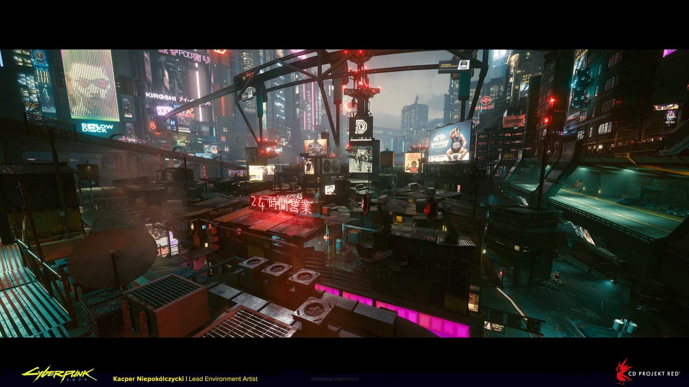
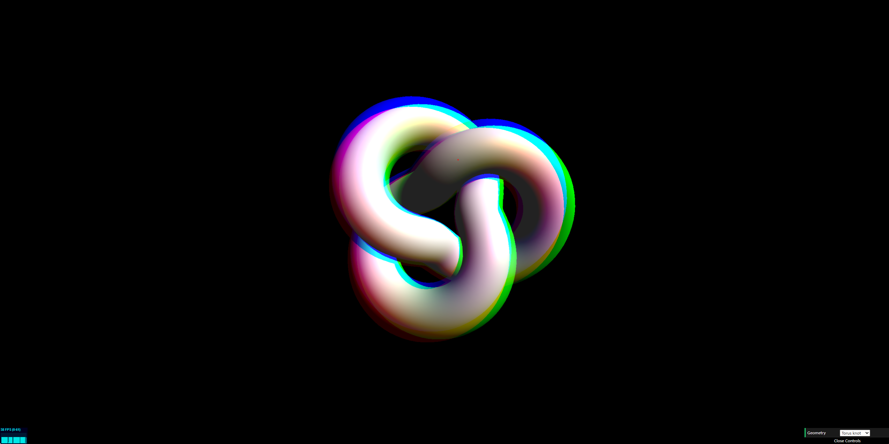

# cmen0322_9103_tut3

# Part 1
I intend to add the lighting effects from *Cyberpunk 2077* to my project. You can see the two screenshots below, especially the neon lighting effects on the building and the car tail. I want to enhance the sci-fi atmosphere of the project scene by contrasting the neon lights with the shadows. To be specific, dynamically adjusting the color and lighting effects to simulate the feeling of neon lights lighting up the surroundings will help improve the immersive feeling.

# Part 2
In order to achieve the abovementioned lighting effect, I researched **WebGL** (Web Graphics Library). WebGL is a JavaScript API that can render 2D and 3D graphics in browser. I mainly wanted to use its shaders to control lighting effect and color to achieve the color effectsin *Cyberpunk 2077*. To be specific, using the Vertex Shader in WebGL to control the position of the vertices and generate different shapes to create neon lights. The Fragment Shader is used to control the color and brightness of the neon lights, and functions are used to achieve the halo effect. 

Here is a link to an example image and the example code.

[Link Text](https://webgl-shaders.com/rgb-example.html)

[Link Text](https://developer.mozilla.org/en-US/docs/Web/API/WebGLShader)

