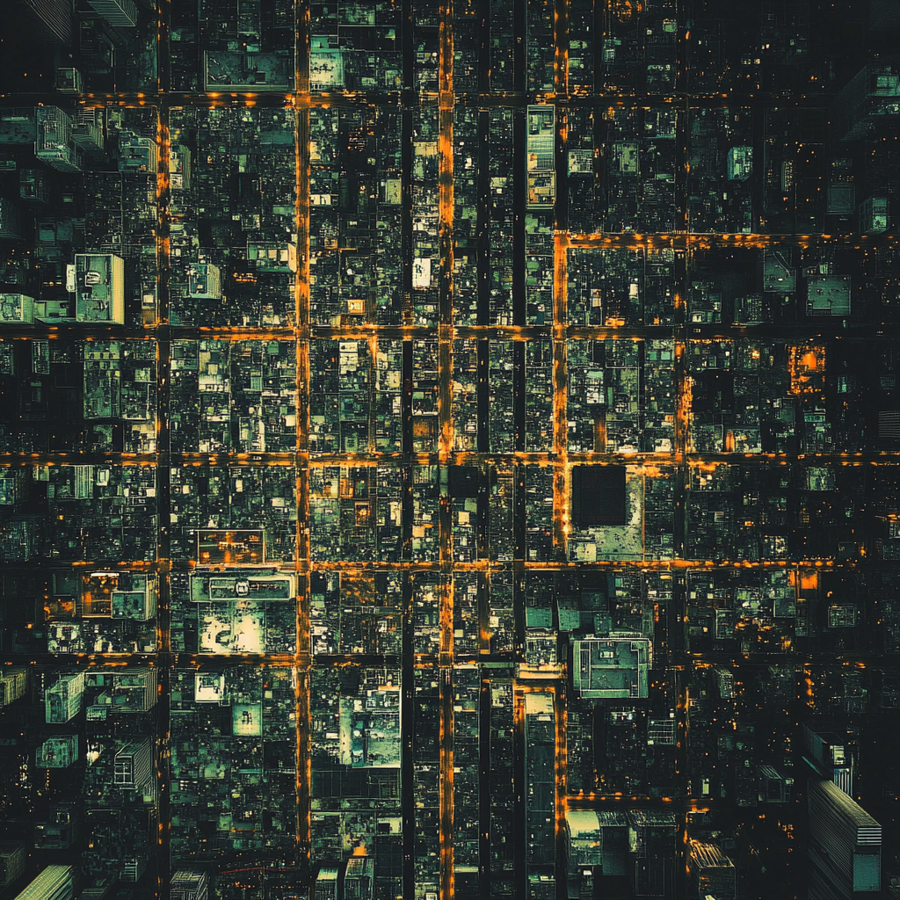

# cmen0322_9103_tut3

# Instructions on how to interact with the work
The animation will start immediately after opening and new city elements will be added every 2.5 seconds to simulate the urbanization process. In total, the code will add new city elements four times, simulating the completed urbanization process after 10 seconds. The timed animation can be restarted by refreshing the page or resizing the window. At the same time, the size of the output animation will be automatically adjusted according to the window size.

# Details of individual approach to animating the group code
- I use timer to drive personal code (time)

- The various blocks in the image will be animated to simulate the urbanization process. At the beginning of the animation, only some of the blocks representing roads, buildings and vehicles will be shown. After that, every 2.5 seconds, more new blocks components will appear, representing more and more roads and buildings as the urbanization progresses. At the same time, small blocks representing cars will also appear on the new road blocks. Their color, position, speed and direction of movement being completely random, adding randomness to the whole work.

- Inspiration for the animation of the personal code: 

as shown the image below, this is an aerial view of the city, where the distribution of the city buildings, and the yellow roads filled with lights are very similar to our group work. I hope to simulate the process of urbanization by constantly adding new blocks (urban elements) to the animation. In this process, we can find that urbanization will allow the social infrastructure to be improved and people's lives to be more convenient. But at the same time, just like in the animation, as new urban elements are added, there are more and more vehicles on the road, which symbolizes the potential problems of urbanization, such as traffic congestion and the occupation of a large number of natural ecological areas with increased environmental pollution.

- Technical explanation：

First, city elements are represented using the Block class, where each block is marked with its position, size, color and whether it is a road block. Define these initial road and building blocks in initializeBlocks() and add new city elements to simulate urbanization in the following addNewCityElement().

Regarding how to make this a timed animation, I use setInterval(() => {...} , interval); to set a timer that calls addNewCityElement() every 2.5 seconds to add more road and building blocks to the scene, simulating the urbanization. Setting the variable urbanizationStage is to keep track of the stage of urbanization and ensure that the growth stops when the maximum stage is reached, avoiding the accumulation of blocks.

In addition, the Car class is created to create car objects that simulate their movement on the road blocks, the cars move horizontally or vertically according to the direction of the road and cycle back to the other side when they reach the boundary. draw() function updates the background, draws all the blocks and moves the car every frame. The car's position, color, speed and direction of movement are random, adding randomness to the animation.

Finally, the windowResized() function makes the canvas redraw when the window is resized and resets the blocks representing the roads, buildings and the small randomized car blocks to avoid accumulation of blocks.

